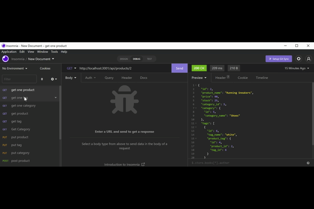

# e-commerce-retail-company 

## Description
The following is an application that replicates the back-end framework of a e-commerce website.
Routes are categorized into three types, Product, Tag, and Category. Included into each are GET, POST, PUT, and Delete routes. Furthermore, the GET route also includes a method to get only one row of information from each type.
The application also utilized mysql2 and sequalize, as dependencies to assist the application.

- `Product` belongs to `Category`, and `Category` has many `Product` models
- `Product` belongs to many `Tag` models, and `Tag` belongs to many `Product` models. 
- Products have multiple tags and tags have many products by using the `ProductTag` model.

# Table of Contents
- [Walkthrough](#walkthrough)
- [Prerequisites](#prerequisites)
- [Installation](#installation)
- [Test](#test)
- [License](#license)
- [Technologies](#technologies)
- [Questions](#questions)
- [Credits](#credits)

## Walkthrough
- [Walkthrough video](https://drive.google.com/file/d/1GmoXvJgBNg16cBzy2oSXQ8lpPy3_YN96/view) : click to watch a step by step tutorial

The following will be a guide that can assist you to download and start the application:
## Prerequisites
- IDE to view(preferably Visual Studio Code).
- Node.js
- MySQL
- REST API software (Insomnia)
## Installation
- Start by cloning repository.
- Navigate to the file in the terminal.
- Perform a npm install to download dependencies.
- Add MySql user name and password to .envEXAMPLE file and change file name to .env.
- Create database in SQL with source db/schema.sql.
- Now the database can be seeded with npm run seed, also changes can be made to seeds file if desired.
- start the application with node server.js or npm start.
### Test
Test can be performed in Insomnia, or similar API software. 
## License
[License: MIT](https://opensource.org/licenses/MIT) : click to learn more!
## Technologies
- Sequelize
- MySQL2
- Express.js
- Node.js
## Questions
If there are questions, reach out to: Richard Ferry
* [LinkedIn](https://www.linkedin.com/in/richard-ferry-83120514b/)
* [GitHub](https://github.com/rich-f-p)
* [email](mailto:richardfpro864@gmail.com)
## Credits
- Base/Started files provided by UC Berkeley Coding Bootcamp.